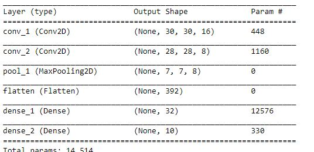
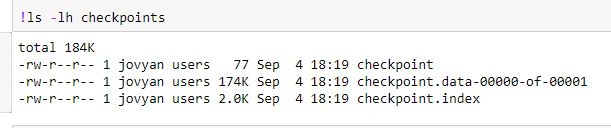
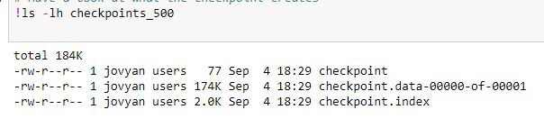

# Project Description

- In this project, i used CIFAR-10 dataset with a simple custom CNN model to train and save it using checkpoints.
    - Model summary
        - 
    
    - Weights only checkpoints

        - 

    - Checkpoint at 500 sample intervals

        - 

    - Checkpoint only best model

        - 
 - Gmail: nathanyilmaasrat@gmail.com
 - Telegram: [Natan Asrat](https://t.me/fail_your_way_to_success)
 - Youtube: [Natville](https://www.youtube.com/@natvilletutor)